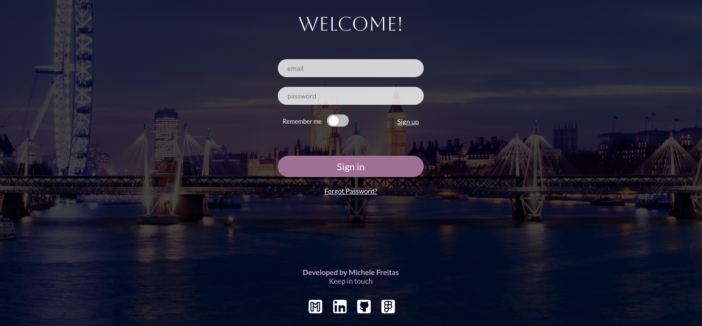
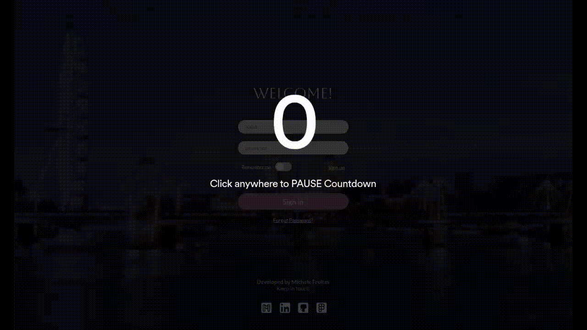

# 🚀 HTML Login Page

## 🌟 This is a modern and clean Login Page Project.

### 📄 Description
This Modern and clean login page was made with HTML5, CSS3 and Javascript, using 
<a href= "https://www.figma.com/file/ucRhnKEXhakCE8SYF4CZOk/LoginPage?node-id=0%3A1&t=SzNMbybEbe5V0Qff-0">Figma</a> design made by me.

### 📷 See it Live

### ✔️ Instructions
- Fork this repository
- Clone it in your machine
- Done! You good to go. 

### 🔗 Link to the Project Page on GitHub Pages

https://github.com/Mmichelefreitas/html-login-page/

### 👄 Let's Talk

    

